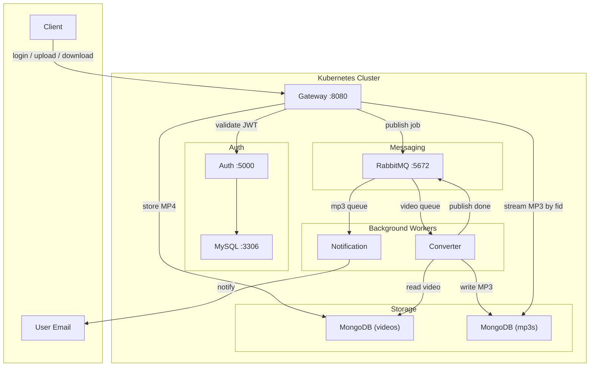

# MP3 Converter Microservices

A microservices-based system that converts uploaded MP4 videos to MP3, stores them, and notifies users by email when the file is ready for download.

---

## Table of Contents

- [Overview](#overview)
- [Architecture](#architecture)
- [Tech Stack](#tech-stack)
- [Services](#services)
- [Prerequisites](#prerequisites)
- [Quick Start](#quick-start)
- [Configuration & Secrets](#configuration--secrets)
- [API Usage](#api-usage)
- [Project Structure](#project-structure)
- [Troubleshooting](#troubleshooting)

---

## Overview

Users authenticate with the gateway, upload an MP4 file, and receive an email when the corresponding MP3 is ready. They can then download the MP3 using the file ID from the email. The conversion runs asynchronously via message queues so the API stays responsive.

---

## Architecture



**Flow:**

1. **Login** → Client sends credentials to Gateway → Gateway calls Auth → Auth validates against MySQL and returns a JWT.
2. **Upload** → Client sends JWT + MP4 file to Gateway → Gateway validates JWT with Auth, stores video in MongoDB (GridFS), publishes a message to the **video** queue.
3. **Converter** consumes from the **video** queue, converts MP4 → MP3 (FFmpeg), stores MP3 in MongoDB (GridFS), publishes a message to the **mp3** queue.
4. **Notification** consumes from the **mp3** queue, sends an email to the user with the MP3 file ID.
5. **Download** → Client sends JWT + `fid` to Gateway → Gateway validates JWT and streams the MP3 from GridFS.

---

## Tech Stack

| Layer        | Technology        |
|-------------|--------------------|
| Runtime     | Python 3.10        |
| API         | Flask              |
| Auth        | JWT, MySQL         |
| Storage     | MongoDB (GridFS)   |
| Message bus | RabbitMQ           |
| Conversion  | FFmpeg / MoviePy   |
| Email       | SMTP (Gmail)       |
| Orchestration | Kubernetes      |
| Local cluster | Minikube        |

---

## Services

| Service       | Port | Role |
|---------------|------|------|
| **Gateway**   | 8080 | Single entry point: login proxy, upload, download; talks to Auth, MongoDB, RabbitMQ. |
| **Auth**      | 5000 | Login and JWT validation; uses MySQL for user store. |
| **Converter** | —    | Consumer: reads from `video` queue, converts to MP3, writes to `mp3` queue. |
| **Notification** | — | Consumer: reads from `mp3` queue, sends email with MP3 fid. |
| **RabbitMQ**  | 5672, 15672 | Queues: `video`, `mp3`. |
| **MySQL**     | 3306 | User table for Auth. |
| **MongoDB**   | 27017 | GridFS: `videos` and `mp3s` databases. |

---

## Prerequisites

- **Docker** (for building images and, if used, Minikube’s runtime)
- **kubectl**
- **Minikube** (or another Kubernetes cluster)
- **Ingress controller** in the cluster (e.g. NGINX Ingress) for the gateway
- A **Gmail account** with an **App Password** (for the notification service)

---

## Quick Start

### 1. Start Minikube and enable Ingress

```bash
minikube start
minikube addons enable ingress
```

### 2. Set the ingress host and add a host entry

Choose a hostname (e.g. `mp3converter.local`). Set it in `gateway/manifests/ingress.yaml` under `spec.rules[].host`, then point it to Minikube’s IP:

```bash
# Linux / macOS (replace <your-ingress-host> with the host from ingress.yaml)
echo "$(minikube ip) <your-ingress-host>" | sudo tee -a /etc/hosts
```

### 3. Create secrets

Secrets are not committed. Create them from the `python/src` directory (or adjust paths). Replace placeholder values with your own.

**Auth** (`auth/manifests/secret.yaml`):

```yaml
apiVersion: v1
kind: Secret
metadata:
  name: auth-secret
stringData:
  MYSQL_PASSWORD: "your_mysql_password"
  JWT_SECRET: "your_jwt_secret"
type: Opaque
```

**MySQL** (`auth/manifests/mysql-secret.yaml`):

```yaml
apiVersion: v1
kind: Secret
metadata:
  name: mysql-secret
stringData:
  MYSQL_ROOT_PASSWORD: "rootpass"
  MYSQL_PASSWORD: "your_mysql_password"   # same as auth's MYSQL_PASSWORD
type: Opaque
```

**Gateway** (`gateway/manifests/secret.yaml`):

```yaml
apiVersion: v1
kind: Secret
metadata:
  name: gateway-secret
stringData:
  # Add any gateway-specific secrets if needed (e.g. placeholders)
  PLACEHOLDER: "none"
type: Opaque
```

**Notification** (`notification/manifests/secret.yaml`):

```yaml
apiVersion: v1
kind: Secret
metadata:
  name: notification-secret
stringData:
  GMAIL_ADDRESS: "your-dummy@gmail.com"
  GMAIL_PASSWORD: "your-16-char-app-password"
type: Opaque
```

**RabbitMQ** and **Converter** – create secrets if your manifests reference them (e.g. `rabbitmq-secret`, `converter-secret`); otherwise you can skip or use minimal placeholders.

### 4. Build images (use Minikube’s Docker so pods can pull them)

Replace `<your-dockerhub-username>` with your Docker Hub username (or any image name you use). The deployment manifests reference these image names, so either use the same names or update the `image:` field in each deployment YAML.

```bash
eval $(minikube docker-env)
cd python/src
docker build -t <your-dockerhub-username>/auth ./auth
docker build -t <your-dockerhub-username>/gateway ./gateway
docker build -t <your-dockerhub-username>/converter ./converter
docker build -t <your-dockerhub-username>/notification ./notification
```

(If you use a remote registry, push these images and set the `image:` in each deployment to your registry path.)

### 5. Apply manifests in order

From `python/src`:

```bash
# Infrastructure
kubectl apply -f auth/manifests/mysql-secret.yaml
kubectl apply -f auth/manifests/mysql-pvc.yaml
kubectl apply -f auth/manifests/mysql-init-configmap.yaml
kubectl apply -f auth/manifests/mysql-deployment.yaml
kubectl apply -f auth/manifests/mysql-service.yaml

kubectl apply -f gateway/manifests/mongodb-pvc.yaml
kubectl apply -f gateway/manifests/mongodb-deployment.yaml
kubectl apply -f gateway/manifests/mongodb-service.yaml

kubectl apply -f rabbit/manifests/
# (includes secret, pvc, statefulset, service, etc.)

# Wait for MySQL, MongoDB, and RabbitMQ to be ready
kubectl get pods -w   # Ctrl+C when relevant pods are Running

# Application
kubectl apply -f auth/manifests/
kubectl apply -f gateway/manifests/
kubectl apply -f converter/manifests/
kubectl apply -f notification/manifests/
```

### 6. Verify

- All pods Running: `kubectl get pods`
- Gateway reachable: `curl -v http://<your-ingress-host>/login` (should get 401 without credentials)

---

## Configuration & Secrets

| Component    | ConfigMap / env           | Secret / env                |
|-------------|---------------------------|-----------------------------|
| Auth        | MYSQL_HOST, MYSQL_USER, MYSQL_DB, MYSQL_PORT | MYSQL_PASSWORD, JWT_SECRET |
| Gateway     | AUTH_SVC_ADDRESS, MONGO_URI | —                          |
| Converter   | MONGO_URI, VIDEO_QUEUE, MP3_QUEUE | — (add if needed)        |
| Notification| MP3_QUEUE, MONGO_URI      | GMAIL_ADDRESS, GMAIL_PASSWORD |
| MySQL       | —                         | MYSQL_ROOT_PASSWORD, MYSQL_PASSWORD |

Default queue names: **video**, **mp3**. Default Auth address: **auth:5000**. MongoDB: **mongo:27017**.

---

## API Usage

Base URL (with ingress): `http://<your-ingress-host>` (use the same host you set in the ingress and `/etc/hosts`).

### 1. Login

Get a JWT. Use the same email and password as a user in the Auth DB (see `auth/manifests/mysql-init-configmap.yaml` for the initial user, or add your own).

```bash
curl -X POST http://<your-ingress-host>/login \
  -u "<email>:<password>"
```

Response: raw JWT string. Use it as `Bearer <token>` below.

### 2. Upload MP4

```bash
export TOKEN="<paste_jwt_here>"
curl -X POST http://<your-ingress-host>/upload \
  -H "Authorization: Bearer $TOKEN" \
  -F "file=@/path/to/video.mp4"
```

Success: `success!` (200). The converter will process the file; when done, the notification service sends an email with the MP3 file ID.

### 3. Download MP3

Use the `fid` from the email:

```bash
curl -o downloaded.mp3 "http://<your-ingress-host>/download?fid=<mp3_fid>" \
  -H "Authorization: Bearer $TOKEN"
```

---

## Project Structure

```
python/src/
├── auth/                 # Auth service (JWT, MySQL)
│   ├── server.py
│   ├── init.sql          # Reference for DB schema
│   ├── Dockerfile
│   └── manifests/        # auth, MySQL (deploy, svc, configmap, secrets, pvc, init)
├── gateway/              # API Gateway
│   ├── server.py
│   ├── auth/             # JWT validation client
│   ├── auth_svc/         # Login proxy to Auth
│   ├── storage/          # Upload to GridFS + publish to RabbitMQ
│   ├── Dockerfile
│   └── manifests/        # gateway, MongoDB, ingress
├── converter/            # Video → MP3 consumer
│   ├── consumer.py       # Consumes `video` queue
│   ├── convert/to_mp3.py # Conversion + publish to `mp3` queue
│   ├── Dockerfile
│   └── manifests/
├── notification/         # Email consumer
│   ├── consumer.py       # Consumes `mp3` queue
│   ├── send/email.py      # Send email with fid
│   ├── Dockerfile
│   └── manifests/
└── rabbit/               # RabbitMQ
    └── manifests/        # StatefulSet, Service, PVC, Secret
```

---

## Troubleshooting

| Issue | What to check |
|-------|----------------|
| **502 / cannot reach gateway** | Ingress and host: `kubectl get ingress`, `/etc/hosts` has your ingress host → Minikube IP. |
| **Login 401** | Auth and MySQL pods running; user exists (see `mysql-init-configmap`); Auth secret has correct `MYSQL_PASSWORD` and `JWT_SECRET`. |
| **Upload 500** | Gateway logs for MongoDB or RabbitMQ errors; MongoDB and RabbitMQ pods running; ConfigMaps (e.g. `MONGO_URI`, queue names) correct. |
| **No email** | Notification pod logs (`kubectl logs -l app=notification`); RabbitMQ Management UI: queue `mp3` has consumers and messages. Gmail: use App Password (16 chars), not account password; if “Connection closed”, try SMTP_SSL on 465 (see notification service code). |
| **Invalid MP3** | Converter uses FFmpeg for encoding; check converter pod logs for ffmpeg errors; ensure converter image has `ffmpeg` with libmp3lame. |
| **Download 500** | Gateway logs; `fid` must be a valid ObjectId in the `mp3s` GridFS. |

Useful commands:

```bash
kubectl get pods
kubectl logs -l app=gateway --tail=50
kubectl logs -l app=notification --tail=50
kubectl logs -l app=converter --tail=50
minikube service list
```

---

## Reference by :
Kantan Coding (freeCodeCamp.org)
## Completed by :
Shreyansh Pagariya

If you like project : give it a ⭐ on GitHub
